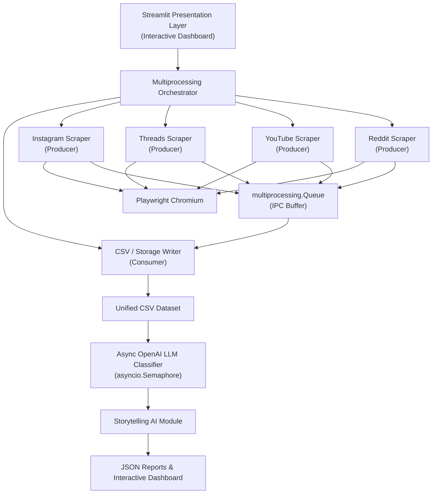

# Multi-Platform Social Media Analysis Using Parallel Scraping

**Academic Research & High-Performance Computing Tool**

Framework modular para la recolección masiva y concurrente de datos desde múltiples redes sociales (Instagram, Threads, YouTube y Reddit), así como para su posterior clasificación semántica mediante Modelos de Lenguaje de Gran Escala (OpenAI GPT-4o-mini).

---

# Tabla de Contenidos

- Overview
- Características del Sistema
- Arquitectura de Cómputo Paralelo
- Plataformas Soportadas
- Instalación y Configuración
- Uso del Sistema
- Estructura del Proyecto
- Métricas y Benchmark de Rendimiento
- Trazabilidad de Datos

---

# Overview

**Social Data Harvester** es una aplicación web interactiva desarrollada en **Python** utilizando **Streamlit**, diseñada para facilitar la recolección, procesamiento y análisis de grandes volúmenes de información provenientes de múltiples redes sociales.

La solución aplica principios de **Computación Paralela** y **Procesamiento Distribuido**, ejecutando procesos independientes para la extracción de datos desde diferentes plataformas. Posteriormente, la información es procesada mediante un pipeline asíncrono de **Procesamiento de Lenguaje Natural (NLP)** para realizar análisis de sentimientos utilizando modelos de lenguaje de OpenAI.

Esta arquitectura mejora significativamente el rendimiento del proceso de extracción, reduce los tiempos de ejecución y permite una mayor escalabilidad al incorporar nuevas fuentes de información.

---

# Características del Sistema

## Extracción Concurrente mediante Multiprocessing

### Uso de múltiples núcleos del procesador

Cada scraper se ejecuta como un proceso independiente utilizando `multiprocessing.Process`, permitiendo aprovechar varios núcleos del procesador y evitando las limitaciones del Global Interpreter Lock (GIL) de Python.

### Aislamiento de procesos

Cada plataforma funciona de manera independiente. Si un scraper presenta inconvenientes (por ejemplo, CAPTCHA, restricciones de acceso o errores de navegación), los demás continúan ejecutándose sin interrupciones.

### Comunicación segura entre procesos

Los datos extraídos se transfieren mediante `multiprocessing.Queue`, implementando un mecanismo seguro de comunicación entre procesos (IPC). Un proceso consumidor centraliza la escritura de la información en los archivos de salida (CSV o SQLite), evitando conflictos durante el acceso concurrente.

# Pipeline de Inteligencia Artificial y Análisis de Sentimientos

## Procesamiento Asíncrono de Alto Rendimiento

El análisis de sentimientos se ejecuta mediante un pipeline asíncrono basado en **asyncio**, permitiendo procesar múltiples publicaciones de manera concurrente.

Para controlar el número de solicitudes simultáneas hacia los modelos de lenguaje se utiliza:

```python
asyncio.Semaphore(10)
```

Este mecanismo permite:

- Procesar grandes volúmenes de publicaciones de forma concurrente.
- Optimizar el rendimiento del sistema.
- Evitar la saturación de las cuotas de las API.
- Mantener un uso eficiente de los recursos disponibles.

## Normalización y Resiliencia

Antes del análisis, las publicaciones son sometidas a un proceso de preprocesamiento que incluye:

- Normalización de texto.
- Limpieza de caracteres especiales y emojis.
- Manejo de expresiones coloquiales y modismos.
- Reintentos automáticos ante errores temporales de las API.

## Módulo de Storytelling AI

Una vez finalizado el análisis de sentimientos, el sistema genera automáticamente un resumen ejecutivo utilizando modelos de lenguaje.

Este módulo produce:

- Resumen de los principales hallazgos.
- Tendencias generales identificadas.
- Interpretación cualitativa de los resultados.
- Reportes listos para su visualización en el dashboard.

---

# Arquitectura de Cómputo Paralelo



---

# Plataformas Soportadas

| Plataforma | Estado | Motor de Extracción | Pipeline de Sentimientos |
|------------|:------:|---------------------|--------------------------|
| Instagram | Activo | Playwright (Chromium) | GPT-4o-mini (Asíncrono) |
| Threads | Activo | Playwright (Chromium) | GPT-4o-mini (Asíncrono) |
| YouTube | Activo | Playwright / API Wrapper | GPT-4o-mini (Asíncrono) |
| Reddit | Activo | Playwright / API Asíncrona | GPT-4o-mini (Asíncrono) |

# Instalación y Configuración

## Requisitos Previos

Antes de ejecutar el proyecto, asegúrese de cumplir con los siguientes requisitos:

- **Python:** versión 3.11 o superior.
- **Playwright:** con el navegador Chromium instalado.

---

## Instalación de Dependencias

Clone el repositorio e instale las dependencias necesarias.

```bash
git clone https://github.com/tu-usuario/Multi-Platform-Social-Media-Analysis.git

cd Multi-Platform-Social-Media-Analysis

pip install -r requirements.txt

playwright install
```

---

## Configuración del Entorno

Cree un archivo denominado `.env` en la raíz del proyecto e incluya las credenciales necesarias para acceder a la API de OpenAI.

```env
OPENAI_API_KEY=sk-proj-...tu_clave_de_openai...
```

> **Importante**
>
> - No publique el archivo `.env` en repositorios públicos.
> - Agregue `.env` al archivo `.gitignore`.
> - Cada desarrollador debe utilizar sus propias credenciales de acceso.

---

# Uso del Sistema

## Ejecución de la Aplicación

Inicie la aplicación mediante Streamlit.

```bash
streamlit run main.py
```

## Flujo de Trabajo

1. **Definir el criterio de búsqueda**

   Ingrese el tema o palabra clave que desea analizar (por ejemplo, *"Inteligencia Artificial en la Educación"*).

2. **Seleccionar las plataformas**

   Elija una o varias redes sociales y establezca el número máximo de publicaciones que se recopilarán por plataforma.

3. **Ejecutar la extracción concurrente**

   Presione **"Iniciar Extracción Paralela"** para iniciar los procesos de scraping de manera simultánea.

4. **Realizar el análisis de sentimientos**

   Una vez finalizada la extracción, seleccione **"Analizar Sentimientos"** para ejecutar el pipeline de inteligencia artificial.

   El sistema generará automáticamente:

   - Clasificación de sentimientos.
   - Gráficos estadísticos.
   - Resúmenes ejecutivos generados mediante Storytelling AI.
   - Reportes en formato JSON.

---

# Estructura del Proyecto

```text
Multi-Platform-Social-Media-Analysis/
│
├── main.py
│   └── Dashboard principal desarrollado con Streamlit y orquestador del sistema.
│
├── process/
│   ├── Process_Instagram.py
│   │   └── Scraper de Instagram basado en Playwright.
│   │
│   ├── Process_Threads.py
│   │   └── Scraper de publicaciones y respuestas de Threads.
│   │
│   ├── Process_Youtube.py
│   │   └── Scraper de comentarios de YouTube.
│   │
│   └── Process_Reddit.py
│       └── Scraper de publicaciones y discusiones de Reddit.
│
├── LLM/
│   ├── sentiment_analyzer_instagram.py
│   ├── sentiment_analyzer_threads.py
│   ├── sentiment_analyzer_youtube.py
│   └── sentiment_analyzer_reddit.py
│
├── data/
│   ├── resultados.csv
│   │   └── Dataset consolidado de publicaciones extraídas.
│   │
│   └── analisis_*_completo.json
│       └── Resultados completos del análisis de sentimientos.
│
├── .env
│   └── Variables de entorno y credenciales de acceso.
│
└── requirements.txt
    └── Dependencias necesarias para ejecutar el proyecto.
```

# Métricas y Benchmark de Rendimiento

El sistema fue evaluado en un equipo con las siguientes características:

- **Procesador:** Quad-Core a 2.40 GHz
- **Memoria RAM:** 16 GB
- **Carga de trabajo:** 40 publicaciones distribuidas entre las plataformas soportadas.

Los resultados obtenidos muestran la mejora de rendimiento alcanzada mediante el uso de **multiprocessing** para la ejecución concurrente de los scrapers.

| Modo de Ejecución | Procesos (p) | Tiempo de Ejecución (Tp) | Speedup (S) | Eficiencia Paralela (E) |
|-------------------|:------------:|-------------------------:|-------------:|------------------------:|
| Secuencial | 1 | 120.0 s | 1.00× | 100.0 % |
| Worker Pool | 2 | 68.5 s | 1.75× | 87.5 % |
| Ejecución Paralela | 4 | 40.0 s | 3.00× | 75.0 % |

> **Resultado:** La implementación basada en **multiprocessing** redujo el tiempo de ejecución en aproximadamente **66.7 %** respecto a la ejecución secuencial.

---

# Trazabilidad de Datos

Con el propósito de facilitar la auditoría y la validación de resultados, cada publicación analizada conserva la información de su origen junto con el resultado generado por el modelo de inteligencia artificial.

## Esquema de salida en JSON

```json
{
  "idPublicacion": "IG_1029384",
  "red_origen": "Instagram",
  "query_utilizada": "Inteligencia Artificial en la educación",
  "texto_original": "Excelente herramienta para personalizar el aprendizaje en el aula...",
  "sentimiento_general": "Positivo",
  "analisis_post": {
    "sentimiento": "Positivo",
    "explicacion": "Muestra apoyo expreso hacia la adopción de IA por parte de docentes.",
    "tiempo_api": 0.396
  }
}
```

## Descripción de los campos

| Campo | Descripción |
|--------|-------------|
| **idPublicacion** | Identificador único asignado a la publicación. |
| **red_origen** | Plataforma desde la cual fue obtenida la publicación. |
| **query_utilizada** | Palabra clave o criterio de búsqueda utilizado durante la extracción. |
| **texto_original** | Contenido original de la publicación antes del procesamiento. |
| **sentimiento_general** | Clasificación general obtenida mediante el modelo de lenguaje. |
| **analisis_post.sentimiento** | Sentimiento identificado por el modelo. |
| **analisis_post.explicacion** | Justificación generada por el modelo para la clasificación realizada. |
| **analisis_post.tiempo_api** | Tiempo empleado por la API para procesar la publicación, expresado en segundos. |